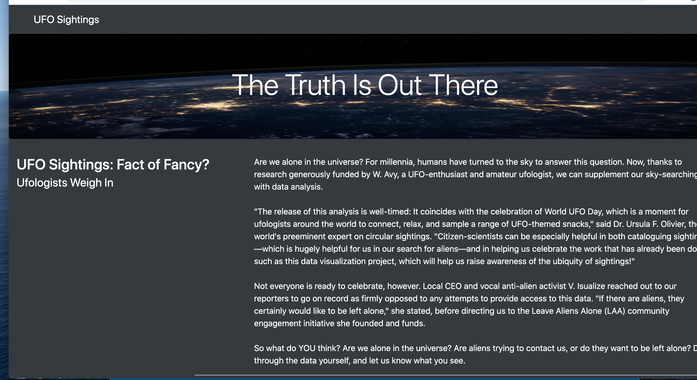
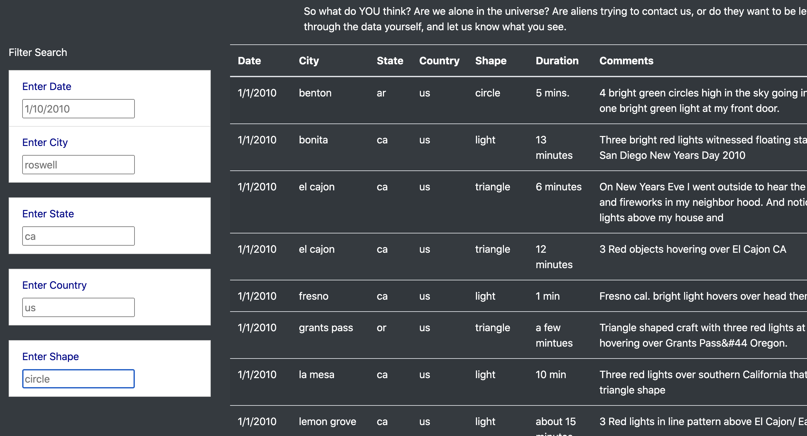

# UFOs

## Overview
Dana’s webpage and dynamic table are working as intended, but she’d like to provide a more in-depth analysis of UFO sightings by allowing users to filter for multiple criteria at the same time. In addition to the date, you’ll add table filters for the city, state, country, and shape

## Results
After the website loads, the user sees the basic opening and title with the picture at the top as pictured below:

As the user scrolls down, there are five search bar filters the user can interact with: date, city, state, country, and shape as pictures below:

The user can interact with multiple filters, and the HTML page displays all of the sightings for that specific search.

## Summary
Ultimately, the webpage is user friendly and user interactive. One drawback of this webpage is that there is a lot of manual work. In addition the filters may not work properly on upper case. Two additional recommendations for further development are to include an update as to the most recent sighting, and to add automation to constantly update data on the site.
